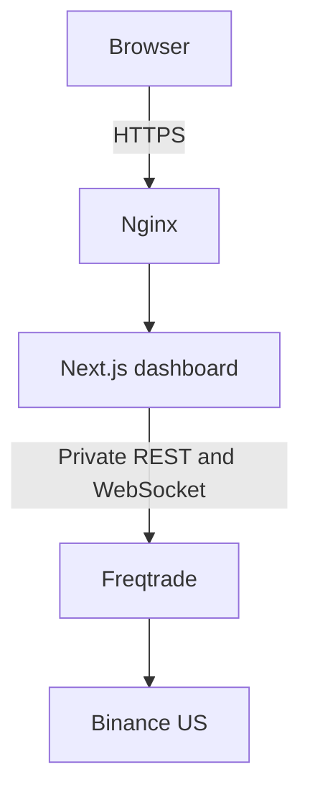

# Binance Spot Bot

[](https://github.com/coylin-zy/binance-bot/actions/workflows/ci.yml)

A private-by-design Binance US spot trading workspace built around Freqtrade, with a
custom Next.js operations dashboard and reproducible Docker deployment files.

> This repository is for research and dry-run operation first. The included template
> keeps `dry_run` enabled. No strategy in this repository should be treated as evidence
> of future profitability.

## Current status

| Area | Status |
| --- | --- |
| Freqtrade core and history | Included |
| Spot strategy | Included; requires backtest and forward validation |
| Trading universe | Fixed BTC/USDT, ETH/USDT, XRP/USDT via `StaticPairList` |
| Secret-free configuration template | Included |
| Dashboard | Implemented with REST BFF and server-side realtime bridge |
| Docker and Nginx files | Included |
| Production deployment | Not performed |
| Real-money readiness | Not approved |

## Architecture



Only Nginx is intended to be public. Freqtrade is bound to the host loopback interface
and shared with the dashboard through the explicitly named Docker network
`binance-bot_internal`.

## Safety boundaries

- The tracked configuration template has `dry_run: true`.
- The validation-stage trading universe is fixed to BTC/USDT, ETH/USDT, and XRP/USDT
  with `StaticPairList`; dynamic volume selection is intentionally disabled.
- Freqtrade API credentials and tokens remain server-side.
- Dashboard sessions use HttpOnly, same-site cookies.
- The BFF permits read endpoints plus `pause`, `stop`, and `start`.
- Manual entry, forced exit, trade deletion, and configuration reload are not exposed.
- Real configuration, `.env.local`, databases, logs, cookies, and backtest output must
  remain untracked.

## Quick start

Requirements: Git, Docker with Compose v2, and Node.js 20+ for local dashboard checks.

```bash
git clone https://github.com/coylin-zy/binance-bot.git
cd binance-bot
cp user_data/config.us.example.json user_data/config.us.json
cp dashboard/.env.example dashboard/.env.local
```

Replace every `CHANGE_ME` value locally. Use different random values for the JWT secret
and WebSocket token. Then start Freqtrade:

```bash
export FREQTRADE_WS_TOKEN="<same websocket token used by Freqtrade>"
docker compose up -d freqtrade
```

Start the dashboard in a second shell:

```bash
cd dashboard
export FREQTRADE_WS_TOKEN="<same websocket token used by Freqtrade>"
docker compose up -d --build
```

The dashboard is published only on `127.0.0.1:3000`; use the Nginx configuration under
`deploy/nginx/` for HTTPS access. PowerShell equivalents and machine-resume notes are
in [BINANCE_BOT.md](BINANCE_BOT.md).

## Validation

Repository and dashboard checks run on every pull request and every push to `main`.
The repository-safety job also rejects changes that replace the fixed whitelist or
`StaticPairList`, so the configured trading universe cannot drift silently.

```bash
FREQTRADE_WS_TOKEN=local-check docker compose config
FREQTRADE_WS_TOKEN=local-check docker compose \
  -f dashboard/docker-compose.yml \
  -f dashboard/docker-compose.override.yml config

cd dashboard
npm ci
npm run check
npm audit --audit-level=high
```

Before any deployment, complete
[the dashboard release checklist](dashboard/docs/release-checklist.md). Keep the bot in
dry-run until the strategy has passed fee-aware backtests, out-of-sample validation,
lookahead analysis, and a forward-testing period.

## Repository layout

- `user_data/strategies/SimpleSpot.py` — current experimental spot strategy.
- `user_data/config.us.example.json` — secret-free Binance US dry-run template.
- `dashboard/` — Next.js monitoring and lifecycle console.
- `deploy/` — Nginx and deployment-specific configuration.
- `freqtrade/`, `tests/`, and `docs/` — preserved Freqtrade upstream source tree.

## Upstream relationship

The default Compose deployment consumes the official `freqtradeorg/freqtrade` image;
it does not build the preserved core source tree. Core updates should therefore be
handled deliberately by either pinning/updating the image or syncing an upstream
Freqtrade commit, not by mixing core updates into strategy or dashboard changes.

Freqtrade is licensed under GPL-3.0. See [LICENSE](LICENSE) and the
[official Freqtrade documentation](https://www.freqtrade.io/).
